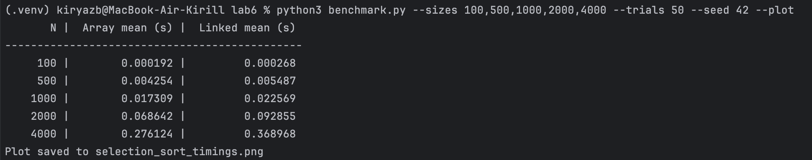
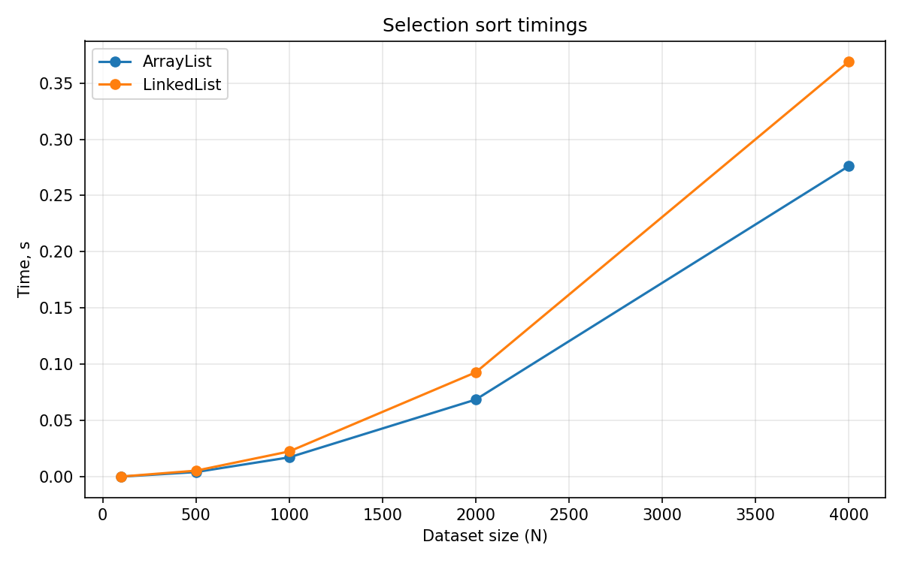

# Лабораторная работа 6. Сортировка выбором (Python)

## Состав и вариант
- Состав бригады: Збуривский К.А.
- Вариант: 10 mod 8 = 2

## Реализованные структуры и алгоритм
- ArrayList (встроенный `list`, файл `algorithms.py`): классический алгоритм сортировки выбором со сложностью `O(n^2)` по времени и `O(1)` по памяти (перестановки элементов на месте).
- Связный список (`LinkedList` на односвязных `Node`, файл `data_structures.py`): тот же алгоритм, поиск минимума через проход по оставшейся части списка; сложность также `O(n^2)` по времени, вспомогательная память `O(1)`.
- Оба варианта используют одинаковые входные данные для честного сравнения; генерация случайных чисел через фиксированный seed.
- Идея алгоритма: на каждой итерации выбираем минимальный элемент в неотсортированной части и обмениваем его с первым элементом этой части; неотсортированная зона сдвигается на один шаг вправо.

## Исходный код
- `data_structures.py` — определение `Node` и `LinkedList`.
- `algorithms.py` — две функции сортировки: `selection_sort_list` и `selection_sort_linked_list`.
- `benchmark.py` — генерация данных, измерение времени, вывод таблицы, опциональный график.
  - `--sizes 100,500,1000,2000,4000` — перечень размеров наборов через запятую.
  - `--trials 3` — число повторов на каждый размер, выводится среднее время.
  - `--seed 42` — seed генератора случайных чисел.
  - `--plot` и `--plot-path selection_sort_timings.png` — сохранение графика (если установлен matplotlib).
  - Верификация отсортированности включена по умолчанию; при необходимости отключить проверку — `--no-verify`.

## Результаты измерений


На связном списке накладные расходы обхода узлов делают реализацию заметно медленнее, хотя обе имеют одинаковую асимптотику `O(n^2)`.

## Как запустить
```bash
python3 benchmark.py --sizes 100,500,1000,2000,4000 --trials 3 --seed 42
# опционально построить график:
python3 benchmark.py --plot
```
